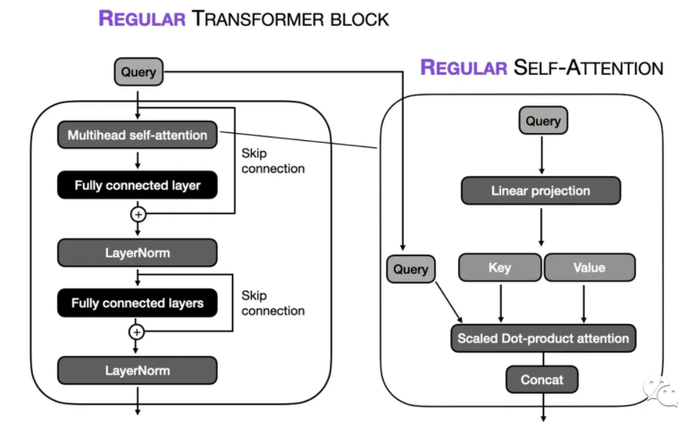
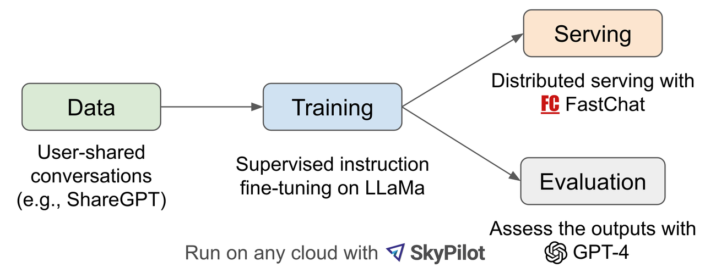
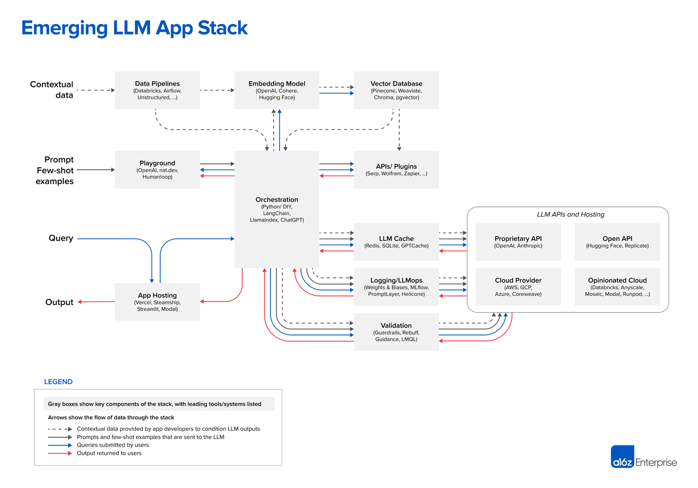
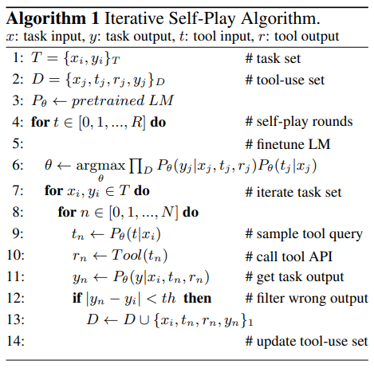
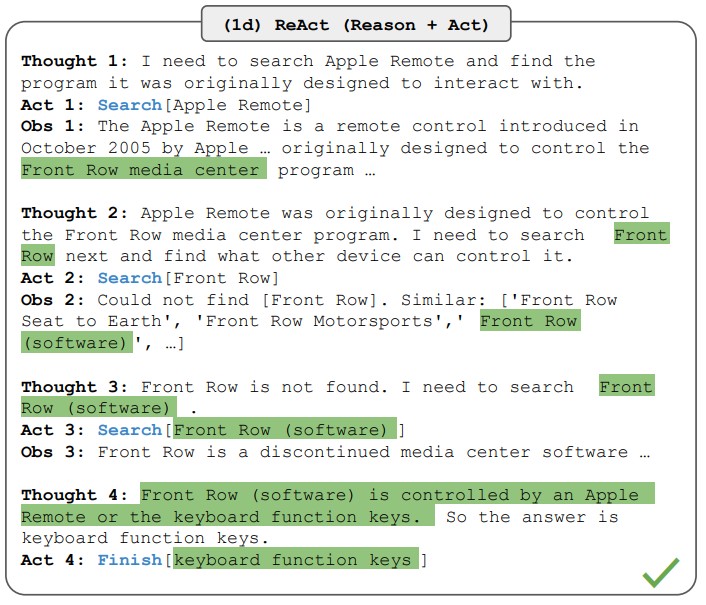
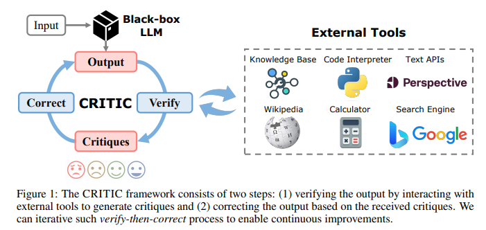
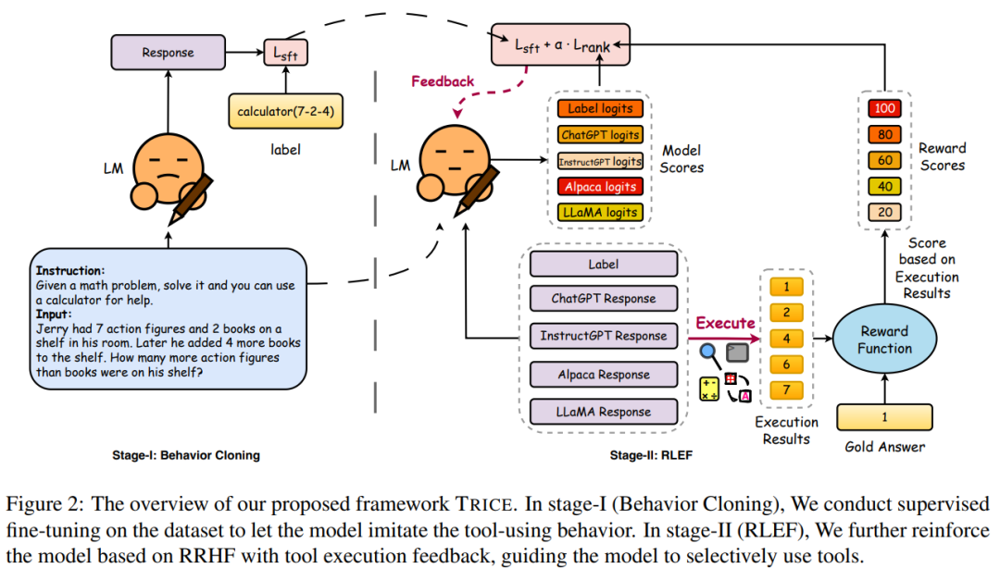

# all-about-llm
大语言模型训练和服务调研
东西太多了感觉会没条理，写到gitbook上了：https://bbb-fullstack-aier.gitbook.io/all-about-llm/

## 目录

- [all-about-llm](#all-about-llm)
  - [目录](#目录)
  - [LLM](#llm)
    - [1. 《GPT-4 Architecture, Infrastructure, Training Dataset, Costs, Vision, MoE》](#1-gpt-4-architecture-infrastructure-training-dataset-costs-vision-moe)
    - [2. 百川大模型](#2-百川大模型)
      - [概述](#概述)
      - [数据](#数据)
      - [模型结构](#模型结构)
      - [训练算力](#训练算力)
      - [模型推理](#模型推理)
    - [3. Aquila 悟道天鹰系列商用开源模型](#3-aquila-悟道天鹰系列商用开源模型)
      - [概述](#概述-1)
      - [模型下载](#模型下载)
    - [4. Chinese-Vicuna: A Chinese Instruction-following LLaMA-based Model —— 一个中文低资源的llama+lora方案](#4-chinese-vicuna-a-chinese-instruction-following-llama-based-model--一个中文低资源的llamalora方案)
      - [概述](#概述-2)
      - [数据](#数据-1)
      - [模型](#模型)
    - [5.  Chinese-LLaMA-Alpaca 开源中文LLaMA模型和指令精调的Alpaca大模型](#5--chinese-llama-alpaca-开源中文llama模型和指令精调的alpaca大模型)
      - [概述](#概述-3)
      - [模型](#模型-1)
      - [量化推理和部署](#量化推理和部署)
      - [数据](#数据-2)
    - [6.  BELLE: Be Everyone's Large Language Model Engine](#6--belle-be-everyones-large-language-model-engine)
    - [7.Tigerbot](#7tigerbot)
      - [概述](#概述-4)
      - [数据](#数据-3)
      - [模型下载](#模型下载-1)
    - [8. Fastchat](#8-fastchat)
    - [9. Vicuna](#9-vicuna)
      - [概述](#概述-5)
      - [数据](#数据-4)
      - [训练过程](#训练过程)
      - [模型](#模型-2)
    - [10. Koala: A Dialogue Model for Academic Research 考拉对话模型](#10-koala-a-dialogue-model-for-academic-research-考拉对话模型)
    - [11.Firefly（流萤）: 中文对话式大语言模型](#11firefly流萤-中文对话式大语言模型)
    - [12. Stanford Alpaca: An Instruction-following LLaMA Model](#12-stanford-alpaca-an-instruction-following-llama-model)
    - [13. GPT4all](#13-gpt4all)
    - [14. WizardLM: An Instruction-following LLM Using Evol-Instruct](#14-wizardlm-an-instruction-following-llm-using-evol-instruct)
    - [15. 文心千帆大模型平台](#15-文心千帆大模型平台)
  - [多模态 Model \& 多模态任务实现方案](#多模态-model--多模态任务实现方案)
    - [1. I-JEPA (the Image-based Joint-Embedding Predictive Architecture)](#1-i-jepa-the-image-based-joint-embedding-predictive-architecture)
    - [2. Video-LLaMA: An Instruction-tuned Audio-Visual Language Model for Video Understanding](#2-video-llama-an-instruction-tuned-audio-visual-language-model-for-video-understanding)
    - [3. MM-React](#3-mm-react)
    - [4. Chameleon: Plug-and-Play Compositional Reasoning with Large Language Models](#4-chameleon-plug-and-play-compositional-reasoning-with-large-language-models)
    - [5. Brain-inspired multimodal hybrid neural network for robot place recognition](#5-brain-inspired-multimodal-hybrid-neural-network-for-robot-place-recognition)
  - [大模型有关项目实现 工具\&参考项目](#大模型有关项目实现-工具参考项目)
    - [优化方向](#优化方向)
    - [一些思考](#一些思考)
    - [数据准备](#数据准备)
    - [数据处理](#数据处理)
    - [模型下载\&转换，训练\&微调](#模型下载转换训练微调)
    - [模型量化推理和部署](#模型量化推理和部署)
    - [框架](#框架)
    - [大模型如何使用外部工具](#大模型如何使用外部工具)
      - [TALM: tool augmented language models](#talm-tool-augmented-language-models)
      - [PAL: Program-aided Language Models](#pal-program-aided-language-models)
      - [Atlas: Few-shot Learning with Retrieval Augmented Language Models](#atlas-few-shot-learning-with-retrieval-augmented-language-models)
      - [Toolformer: Language Models Can Teach Themselves to Use Tools](#toolformer-language-models-can-teach-themselves-to-use-tools)
      - [ART: Automatic multi-step reasoning and tool-use for large language models](#art-automatic-multi-step-reasoning-and-tool-use-for-large-language-models)
      - [ReAct: Synergizing Reasoning and Acting in Language Models](#react-synergizing-reasoning-and-acting-in-language-models)
      - [CRITIC: Large Language Models Can Self-Correct with Tool-Interactive Critiquing](#critic-large-language-models-can-self-correct-with-tool-interactive-critiquing)
      - [Making Language Models Better Tool Learners with Execution Feedback](#making-language-models-better-tool-learners-with-execution-feedback)
    - [人工智能体 AI Agent](#人工智能体-ai-agent)
      - [项目1：斯坦福、谷歌「西部世界](#项目1斯坦福谷歌西部世界)
      - [项目2：Camel](#项目2camel)
      - [项目3：BabyAGI](#项目3babyagi)
      - [项目4：AutoGPT](#项目4autogpt)
    - [效果评估](#效果评估)
    - [常见bug解决](#常见bug解决)
  - [参考资料](#参考资料)
    - [Paper\&Post](#paperpost)
    - [工具网址](#工具网址)
    - [API tools](#api-tools)
      - [搜索类：](#搜索类)
      - [自动化工作类：](#自动化工作类)
    - [项目整合](#项目整合)
    - [一些值得关注的issues](#一些值得关注的issues)
    - [LLM成长路线图](#llm成长路线图)
    - [LLM术语](#llm术语)
      - [Adapter](#adapter)
      - [Alpaca](#alpaca)
      - [Attention](#attention)
      - [Cosine Similarity](#cosine-similarity)
      - [Embedding](#embedding)
      - [GPTQ](#gptq)
      - [Instruction Tuning](#instruction-tuning)
      - [LoRA](#lora)
      - [Prefix tuning https://arxiv.org/abs/2101.00190](#prefix-tuning-httpsarxivorgabs210100190)
      - [Prompt Tuning](#prompt-tuning)
      - [QLoRA](#qlora)
      - [RLHF](#rlhf)
      - [Self-instruction](#self-instruction)
      - [semantic search](#semantic-search)
      - [Tokenization](#tokenization)
      - [Topic Modeling](#topic-modeling)
      - [Transformer](#transformer)
  - [LLMs Surveys](#llms-surveys)

## LLM

### 1. [《GPT-4 Architecture, Infrastructure, Training Dataset, Costs, Vision, MoE》](https://www.semianalysis.com/p/gpt-4-architecture-infrastructure)


### 2. [百川大模型](https://github.com/baichuan-inc/baichuan-7B)
	
完全支持商用的模型
发布团队：百川智能
家族：llama

注意仓库中的评测结果是基于sft和RLHF 但是目前开源的model是pretrain版本	

预训练模型续写的句子有比较大的问题（可能来自于语料问题？）

{'text': '今天天气是真的有点热,我走在街上的时候,发现了很多人的脸上泛了红色的......\n我走在街上的时候,发现了很多人的脸上泛了红色的,我问老爸:为什么现在有这么多人的脸上都长了斑呢?老爸说:因为天气太热了,脸上没有汗水的滋润,皮肤没有光泽了。你别问了,我现在正在去开会的地方的路上。'}

**7b预计在A100占用显存 ：27689MB  ； 4090占用显存23.6G 推理速度很慢**

####  概述

基于Transformer结构，在大约1.2万亿tokens上训练的70亿参数模型，支持中英双语，上下文窗口长度为**4096**P

**针对chat的微调方案（非官方）**：
- MedicalGPT：https://github.com/shibing624/MedicalGPT/blob/main/README.md
- LLaMA-Efficient-Tuning ：
https://github.com/hiyouga/LLaMA-Efficient-Tuning

**问题：评测封闭性不好**？⬇️

	输入：
	在Unix中，passwd命令位于____目录中的。
	输出：
	在Unix中，passwd命令位于____目录中的。 A. /etc/ B. /usr/ C. /bin/ D. /usr/bin/ 答案：A</s>
**分词**
使用SentencePiece中的Byte-PairEncoding(BPE)作为分词算法，并且进行了以下的优化：
* 使用2000万条以中英为主的多语言语料训练分词模型，提升对于中文的压缩率。
* 对于数学领域，参考了LLaMA和Galactica中的方案，对数字的每一位单独分开，避免出现数字不一致的问题，对于提升数学能力有重要帮助。
* 对于罕见字词（如特殊符号等），支持UTF-8characters的byte编码，因此做到未知字词的全覆盖，词表大小达到6.4万。
* 对中文的压缩率比较高（？压缩率咋算的？？？？）

| Model         | baichuan\-7B | LLaMA  | Falcon | mpt\-7B | ChatGLM | moss\-moon\-003 |
|---------------|--------------|--------|--------|---------|---------|-----------------|
| Compress Rate | 0\.737       | 1\.312 | 1\.049 | 1\.206  | 0\.631  | 0\.659          |
| Vocab Size    | 64,000       | 32,000 | 65,024 | 50,254  | 130,344 | 106,029         |

#### 数据


#### 模型结构
  整体模型基于标准的 Transformer 结构，采用了和 LLaMA 一样的模型设计
   
- **位置编码** rotary-embedding 是现阶段被大多模型采用的位置编码方案，具有更好的外延效果。虽然训练过程中最大长度为4096，但是实际测试中模型可以很好的扩展到 5000 tokens 上，如下图：
  
- **具体参数**

	| **Hyperparameter** | **Value**  |
	|--------------------|------------|
	| n_parameters       | 7000559616 |
	| n_layers           | 32         |
	| n_heads            | 32         |
	| d_model            | 4096       |
	| vocab size         | 64000      |
	| sequence length    | 4096       |


- 激活层：SwiGLU, Feedforward 变化为(8/3)倍的隐含层大小，即11008
- Layer-Normalization: 基于 RMSNorm 的 Pre-Normalization
#### 训练算力
千卡A800机器上达到了7B模型182Tflops的吞吐，GPU峰值算力利用率高达58.3% 。训练稳定性和吞吐
#### 模型推理

[huggingface](https://huggingface.co/baichuan-inc/baichuan-7B)


### 3. [Aquila 悟道天鹰系列商用开源模型](https://github.com/FlagAI-Open/FlagAI/blob/master/examples/Aquila/README.md)

**发布团队**：智源社区
要用flagAI框架（这个框架源码&依赖的兼容性还有一些错误）
关注issue：https://github.com/FlagAI-Open/FlagAI/issues/334
这个问题官方正在修复
#### 概述
**官方简介**
Aquila语言大模型在技术上继承了GPT-3、LLaMA等的架构设计优点，替换了一批更高效的底层算子实现、重新设计实现了中英双语的tokenizer，升级了BMTrain并行训练方法，在Aquila的训练过程中实现了比Magtron+DeepSpeed zero-2将近８倍的训练效率。Aquila语言大模型是在中英文高质量语料基础上从０开始训练的，通过数据质量的控制、多种训练的优化方法，实现在更小的数据集、更短的训练时间，获得比其它开源模型更优的性能。也是首个支持中英双语知识、支持商用许可协议、符合国内数据合规需要的大规模开源语言模型。

**最低硬件需求**： **运行Aquila-7B系列需要内存30G, 显存18G，生成最大长度 2048 tokens。**

Aquila模型所采用的tokenizer是由从头开始训练的，支持中英双语。我们在处理英文、中文以及代码数据时，采用了不同的分词器对一万个样本进行了抽取。Aquila tokenizer与其他tokenizer的参数对比见下表:

| **模型/Model** | **词表大小/Vocab size** | **说明/Note** | **英文平均tokens量/Avg tokens \(English \)** | **中文平均tokens量/Avg tokens \(Chinesse \)** | **代码平均tokens量/Avg tokens \(code\)** |
|--------------|---------------------|-------------|---------------------------------------|----------------------------------------|------------------------------------|
| GPT2         | 50527               | bpe         | 1717                                  | 1764                                   | 2323                               |
| LlaMA        | 32000               | sp\(bpe\)   | 1805                                  | 1257                                   | 1970                               |
| Aquila       | 100000              | bpe         | 1575                                  | 477                                    | 1679                               |

#### 模型下载
- 脚本下载
-  FlagOpen 模型仓库下载 https://model.baai.ac.cn/models

其他信息等待六月底官方技术报告


### 4. [Chinese-Vicuna: A Chinese Instruction-following LLaMA-based Model —— 一个中文低资源的llama+lora方案](https://github.com/Facico/Chinese-Vicuna)

这种方案可能会降低模型的泛化能力

git仓库提供了一个针对llama系列工程很好的QA文档：https://github.com/Facico/Chinese-Vicuna/blob/master/docs/notes.md

有关技术
- LLaMA paper: https://arxiv.org/abs/2302.13971v1
- Self-Instruct paper: https://arxiv.org/abs/2212.10560
- data generation: https://github.com/LianjiaTech/BELLE and https://guanaco-model.github.io/
- the first work: https://github.com/tatsu-lab/stanford_alpaca
- Lora paper：https://arxiv.org/pdf/2106.09685.pdf
#### 概述
**特点**：llama+中文+低资源+垂料训练的方案 
  基于LLaMA+instruction数据构建一个中文的羊驼模型，并帮助大家能快速学会使用引入自己的数据，并训练出属于自己的小羊驼（Vicuna）
  类似于stable diffusion模型的爆火，出现了像civitai等平台，由一个基础的模型+各种LORA模型的开源社区。这个项目就是去训练这个LORA
**Lora训练方式**：
- 代码基于alpaca-lora开发，https://github.com/tloen/alpaca-lora
- 这是一套比较简单的代码，基本思路就是用PEFT的lora接口+transformer的trainer+instruction的数据配置
**训练算力配置：**（来源为项目github）
	4090的算力约为3090两倍，A100-40G的int8算力与4090相近
  
	| **Model** | **GPU** | **lora+fp16+512** |  | **lora+int8+256** |  | **lora+int8+512** |  | **lora+int8+2048** | |
	|-----------|---------|--------------------|------|--------------------|------|--------------------|------|---------------------|------|
	|           |         | speed              | size | speed              | size | speed              | size | speed               | size |
	| LLaMA-7B  | 2080Ti  |                    |      | 0.2h/w            | 11G  |                    |      |                     |      |
	|           | 3090    |                    |      |                    |      |                    |      |                     |      |
	|           | 4090    | 0.3h/w            | 20G  |                    |      | 0.8h/w            |      | 3.5h/w              | 20G  |
	| LLaMA-13B | 3090    |                    |      | 0.9h/w            |      |                    |      | 7.5h/w              | 24G  |
	|           | 4090    |


**注意：**
- int8 仅加载模型显存占用（VRAM）$ \approx $ 硬盘空间大小，比如7B大概8G左右，13B大概14G左右；如果是fp16和fp32则相应乘2和乘4
- 训练的时候，显存占用和训练的速度和序列长度密切相关，比如序列长度256显存占用不超过11G，这个时候可以在2080Ti上微调7B，序列长度如果是2048，则显存占用会骤增到20G，就要上3090或者4090才能微调7B了；
- 同理，13B在3090/4090上是可以微调的，2048的时候microbatch降到1也是可以跑的
- 另外，有人发现在A100-40G上增大batch没有明显的提速，这可能是因为int8比较吃算力（比如相同的配置fp16快于int8），算力吃满后增加batch也不能提高吞吐量，另一方面A100-40G的int8算力其实和4090差不多。
#### 数据
利用了目前几份高质量的开源数据（这些数据很多都像alpaca那样，使用chatgpt的接口，生成高质量的instruction数据。）
{"instruction": "用一句话描述地球为什么是独一无二的。\\n\n", "input": "", "output": "地球上有适宜生命存在的条件和多样化的生命形式。"}
- Belle https://github.com/LianjiaTech/BELLE
- guanaco https://huggingface.co/datasets/JosephusCheung/GuanacoDataset
数据下载链接
- 有更好对话能力的chatv1的微调数据：https://huggingface.co/datasets/Chinese-Vicuna/instruct_chat_50k.jsonl ：由3万条sharegpt中文数据和2万条alpaca-instruction-Chinese-dataset数据组成
- 链接: https://pan.baidu.com/s/1WSxuhSAotl14ifaAiz5eKw?pwd=b4kb 提取码: b4kb
- 链接: https://drive.google.com/file/d/1tzXVhS74m-EtoFot7hEc005LDeZGPit_/view?usp=sharing
- 链接: https://huggingface.co/datasets/Chinese-Vicuna/guanaco_belle_merge_v1.0 （694K rows  409MB）
#### 模型
- 上游模型：LLAMA 7B
- 项目提供了lora模型
  - 加载方式参考generate.py
    - Chinese-Vicuna/Chinese-Vicuna-lora-7b-belle-and-guanaco
    - Chinese-Vicuna/Chinese-Vicuna-lora-13b-belle-and-guanaco
  - 模型使用的是8bit+lora+256 tokens
  - 更多模型：https://huggingface.co/Chinese-Vicuna

### 5.  [Chinese-LLaMA-Alpaca 开源中文LLaMA模型和指令精调的Alpaca大模型](https://github.com/ymcui/Chinese-LLaMA-Alpaca)

chinese-vicuna中提到这个项目：**做了词表扩充但是效果不及没有扩充词表的fastchat-vicuna**

这个项目给了一个扩充词表的思路&开源了很多有用的工具和代码;项目wiki有很多干货;训练代价比较大

#### 概述

**技术报告**：[Efficient and Effective Text Encoding for Chinese LLaMA and Alpaca](https://arxiv.org/abs/2304.08177)

- 🚀 针对原版LLaMA模型扩充了中文词表，提升了中文编解码效率
- 🚀 开源了使用中文文本数据预训练的中文LLaMA以及经过指令精调的中文Alpaca
- 🚀 开源了预训练脚本、指令精调脚本，用户可根据需要进一步训练模型
- 🚀 快速使用笔记本电脑（个人PC）的CPU/GPU本地量化和部署体验大模型
- 🚀 支持🤗transformers, llama.cpp, text-generation-webui, LlamaChat, LangChain, privateGPT等生态
- 目前已开源的模型版本：7B（基础版、Plus版）、13B（基础版、Plus版）、33B（基础版） （模型大小相同 plus版本使用的数据更多）
  
**训练配置：**
以下是训练基础版7B模型的训练配置。更多详情请参考技术报告。

| **实验设置**                   | **预训练-第一阶段**     | **预训练-第二阶段**     | **指令精调**          |
|----------------------------|-------------------|-------------------|-------------------|
| Batch Size                 | 1024              | 1024              | 512               |
| Initial Learning Rate      | 2.00E-04        | 1.00E-04        | 1.00E-04        |
| Training Steps             | 3K                | 6K                | 6K-10K           |
| Max Length                 | 512               | 512               | 512               |
| Trainable Parameters (%) | 2.97%            | 6.06%            | 6.22%            |
| Training Device            | 8 × A100          | 16 × A100         | 16 × A100         |
| Distributed Training       | DeepSpeed Zero-2 | DeepSpeed Zero-2 | DeepSpeed Zero-2 |

**训练细节**
- 在通用中文语料上训练了基于sentencepiece的20K中文词表并与原版LLaMA模型的32K词表进行合并--最终词表大小49953&49954
- 更多细节见：https://github.com/ymcui/Chinese-LLaMA-Alpaca/wiki/%E8%AE%AD%E7%BB%83%E7%BB%86%E8%8A%82


#### 模型
发布的是LoRA权重，需要搭配[原版LLaMA模型](https://github.com/facebookresearch/llama)，然后[合并模型](https://github.com/ymcui/Chinese-LLaMA-Alpaca#%E5%90%88%E5%B9%B6%E6%A8%A1%E5%9E%8B)。
下载后务必检查压缩包中模型文件的SHA256是否一致，请查看[SHA256.md](https://github.com/ymcui/Chinese-LLaMA-Alpaca/blob/main/SHA256.md)。

**模型对比**

| **对比项**                  | **中文LLaMA**                 | **中文Alpaca**                            |
|--------------------------|-----------------------------|-----------------------------------------|
| 训练方式                     | 传统CLM                       | 指令精调                                    |
| 训练语料                     | 无标注通用语料                     | 有标注指令数据                                 |
| 词表大小              | 49953                       | 49954=49953\+1（pad token）               |
| 输入模板                     | 不需要                         | 需要符合模板要求                         |
| 适用场景 ✔️                  | 文本续写：给定上文内容，让模型继续写下去，生成下文   | "1、指令理解（问答、写作、建议等）                      |
|多轮上下文理解（聊天等）          |
| 不适用场景 ❌                  | 指令理解 、多轮聊天等                 | 文本无限制自由生成                               |
| llama\.cpp               | 使用\-p参数指定上文                 | 使用\-ins参数启动指令理解\+聊天模式                   |
| text\-generation\-webui  | 不适合chat模式                   | 使用\-\-cpu可在无显卡形式下运行，若生成内容不满意，建议修改prompt |
| LlamaChat                | 加载模型时选择"LLaMA"              | 加载模型时选择"Alpaca"                         |
| HF推理代码                   | 无需添加额外启动参数                  | 启动时添加参数 \-\-with\_prompt                |
| web\-demo代码              | 不适用                         | 直接提供Alpaca模型位置即可；支持多轮对话                 |
| LangChain示例 / privateGPT | 不适用                         | 直接提供Alpaca模型位置即可                        |
| 已知问题                     | 如果不控制终止，则会一直写下去，直到达到输出长度上限。 | 目前版本模型生成的文本长度相对短一些，比较惜字如金。可在指令中要求详细回答。  |

**Lora下载：**

| **模型名称**                     | **训练数据** | **重构模型**     | **大小** | **LoRA下载** |
|------------------------------|----------|-------------------|-------------|-----------------|
| Chinese\-LLaMA\-7B           | 通用20G    | 原版LLaMA\-7B       | 770M        | [百度网盘](https://pan.baidu.com/s/1xV1UXjh1EPrPtXg6WyG7XQ?pwd=923e) [googledrive](https://drive.google.com/file/d/1JvFhBpekYiueWiUL3AF1TtaWDb3clY5D/view?usp=sharing)    |          |
| Chinese\-LLaMA\-Plus\-7B ⭐️  | 通用120G   | 原版LLaMA\-7B       | 790M        |[百度网盘](https://pan.baidu.com/s/12tjjxmDWwLBM8Tj_7FAjHg?pwd=32hc) [googledrive](https://drive.google.com/file/d/1EDcTmq6tDmRxqarpapdyDGBE9opY0zrB/view?usp=share_link)     |         |
| Chinese\-LLaMA\-13B          | 通用20G    | 原版LLaMA\-13B      | 1\.0G       | [百度网盘](https://pan.baidu.com/s/1wYoSF58SnU9k0Lndd5VEYg?pwd=mm8i) [googledrive](https://drive.google.com/file/d/1gzMc0xMCpXsXmU1uxFlgQ8VRnWNtDjD8/view?usp=share_link)       |          |
| Chinese\-LLaMA\-Plus\-13B ⭐️ | 通用120G   | 原版LLaMA\-13B      | 1\.0G       | [百度网盘](https://pan.baidu.com/s/1Mew4EjBlejWBBB6_WW6vig?pwd=mf5w) [googledrive](https://drive.google.com/file/d/1CcLJvY7XsFAOjfSIqCpDI7jf3EEPDcEF/view?usp=share_link)       |              |
| Chinese\-LLaMA\-33B          | 通用20G    | 原版LLaMA\-33B\ | 2\.7G       |  [百度网盘](https://pan.baidu.com/s/1fey7lGMMw3GT982l8uJYMg?pwd=2f2s) [googledrive](https://drive.google.com/file/d/1YeSgnZWaRkKdmYa-JHiIlcvqhrDd4-Y4/view?usp=share_link)          |

同时：可以在🤗Model Hub下载以上所有模型，并且使用transformers和PEFT调用中文LLaMA或Alpaca LoRA模型。详细见项目git仓库

#### 量化推理和部署
[参考](https://github.com/ymcui/Chinese-LLaMA-Alpaca/wiki/%E6%A8%A1%E5%9E%8B%E6%8E%A8%E7%90%86%E4%B8%8E%E9%83%A8%E7%BD%B2)

#### 数据

**预训练语料**
在预训练阶段，使用约20G左右的通用中文语料（与中文BERT-wwm、MacBERT、LERT、PERT中使用的语料一致）在原版LLaMA权重的基础上进一步进行预训练

**指令精调语料**

| **数据**              | **量级** | **来源** | **说明**                         |
|---------------------|--------|--------|--------------------------------|
| 中英翻译数据              | 500K   | [外部链接](https://github.com/brightmart/nlp_chinese_corpus#5%E7%BF%BB%E8%AF%91%E8%AF%AD%E6%96%99translation2019zh)   | 在原数据集的基础上进行了采样\+规则筛选           |
| pCLUE数据             | 300K   | [外部链接](https://github.com/CLUEbenchmark/pCLUE)   | 在原数据集的基础上进行了采样\+规则筛选           |
| Alpaca数据（英）         | 50K    | [外部链接](htthttps://github.com/ymcui/Chinese-LLaMA-Alpaca/tree/main/dataps://github.com/tatsu-lab/stanford_alpaca)  | 斯坦福原版Alpaca训练数据                |
| Alpaca数据（中）         | 50K    | [外部链接]()  | 本项目使用ChatGPT接口将英文版翻译为中文（筛掉一部分） |
| Self\-instruction数据 | 1~2M   | （暂无）   | 本项目使用ChatGPT接口进行爬取，具体见以下脚本描述   |

本项目提供了一个动态生成不同领域和指令类型的prompt爬取脚本 `script/crawl_prompt.py`

### 6.  [BELLE: Be Everyone's Large Language Model Engine](https://github.com/LianjiaTech/BELLE)

相比如何做好大语言模型的预训练，BELLE更关注如何在开源预训练大语言模型的基础上，帮助每一个人都能够得到一个属于自己的、效果尽可能好的具有指令表现能力的语言模型，降低大语言模型、特别是中文大语言模型的研究和应用门槛.

### 7.[Tigerbot](https://github.com/TigerResearch/TigerBot)
- [ ] 为什么tigerbot使用100w数据指令微调的结果比不上vicuna使用50k数据微调的结果，是pretraining模型有问题还是bloom底座就是不行呢（用basemodel测试一下）
  
模型对标instuctGPT-6B 目前7b模型的效果一般 可能训练过程有很多脏数据 比较明显的问题是会输出各种多余的符号

demo网页：https://tigerbot.com/chat

#### 概述

**发布机构**：虎博科技
**家族**：bloom  
关于为什么使用bloom基座而不是更火3的llama：1 bloom基座可以商用 / 2 项目开始时间早于llama
**成员**：TigerBot-7B, TigerBot-7B-base，TigerBot-180B (research version)
**功能**：提供了三种 API，包括 Chat-API，Plug-ins，**Fine-Tunes**。
**数据**：预训练 100G，从 2TB 过滤后的数据中经过去噪去重清洗而得；监督微调 1G 或 100 万条数据，按比例涵盖用户指令常见的 10 大类 120 小类任务

**官方介绍:**
在 BLOOM 基础上，在模型架构和算法上做了如下优化：
- 指令完成监督微调的创新算法以获得更好的可学习型(learnability)，
- 运用 ensemble 和 probabilistic modeling 的方法实现更可控的事实性(factuality)和创造性(generativeness)，
- 在并行训练上，突破了 deep-speed 等主流框架中若干内存和通信问题，使得在千卡环境下数月无间断（负责人说是改了deepseed源码实现）
- 对中文语言的更不规则的分布，从 tokenizer 到训练算法上做了更适合的算法优化。
量化：使用GPTQ算法和GPTQ-for-LLaMa实现量化：

**训练算力**：
7b模型  单卡a100 40G就可以训练
180b模型  
**推理算力**：
量化前：`tigerbot-7b-sft` 推理可在1张RXT3090上进行；`tigerbot-180b-sft` 推理可在5张A100(80G)上进行    
**量化后**：`tigerbot-7b-sft-4bit-128g` 推理可在一张RTX3090上进行 `tigerbot-180b-research-4bit-128g` 推理可在两张A100(80G)上进行

#### 数据

**预训练数据**
基于 GPT3 的 pretrain 的数据分布，采集中文书籍，互联网，和百科类数据，并通过数据源质量分过滤和 tf-idf soft deduping，从 20TB 数据过滤到 2TB，保持语言和类目的比例，并在此基础上随机抽样 100G 数据开源
开源数据集
- [中文开源预训练集 - 55G，包含中文书籍、中文互联网、中文百科](https://huggingface.co/datasets/TigerResearch/pretrain_zh)
- [英文开源预训练集 - 51G，包含英文书籍、英文互联网、英文百科](https://huggingface.co/datasets/TigerResearch/pretrain_en)
  
**微调数据**
数据下载链接和清洗规则见项目github

开源数据集
- 指令数据集, 当前开源 120W 问答对，磁盘空间 1.1G （数据集开放到 huggingface）
- 领域数据开放金融、法律、百科相关领域数据，作为 rethink 外部数据
  

#### 模型下载
| **Tigerbot\-7B**              | **Bits** | **memory\(GB\)** |
|-------------------------------|----------|------------------|
| tigerbot\-7b\-base            | 16       | 17\.2            |
| tigerbot\-7b\-sft             | 16       | 17\.2            |
| tigerbot\-7b\-sft\-4bit\-128g | 4        | 8\.5             |

| **Tigerbot\-180B\-Research**    | **Bits** | **memory\(GB\)** |
|---------------------------------|----------|------------------|
| tigerbot\-180b\-sft             | 16       | 347\.6           |
| tigerbot\-180b\-sft\-4bit\-128g | 4        | 108\.5           |

### 8. [Fastchat](https://github.com/lm-sys/FastChat)

FastChat 是一个开放平台，用于训练、服务和评估基于大型语言模型的聊天机器人。核心功能包括：

最先进模型（例如，Vicuna、FastChat-T5）的权重、训练代码和评估代码。
具有 Web UI 和与 OpenAI 兼容的 RESTful API 的分布式多模型服务系统。


### 9. Vicuna

用 ShareGPT 收集的对话数据微调 LLaMA实现   用GPT-4评价效果
不擅长数学推理、编码任务，语言逻辑上整体是英文逻辑（比如中文任务会导致状语后置&夹杂英文单词等）



使用openai [moderation](https://platform.openai.com/docs/guides/moderation/overview) api来进行审核 

#### 概述

**数据**：70K 对话对
**训练**：增强了 Alpaca 提供的训练脚本，以更好地处理多轮对话和长序列。一天内在 8 个 A100 GPU 上使用 PyTorch FSDP 完成
**算力需求**：训练 ：8 个 A100 GPU

官方[blog](https://lmsys.org/blog/2023-03-30-vicuna/#how-good-is-vicuna)提供了一个对比表格：

 **Model Name**          | **LLaMA**                                | **Alpaca**                                           | **Vicuna**                                 | **Bard/ChatGPT** |
|-------------------------|------------------------------------------|------------------------------------------------------|--------------------------------------------|------------------|
| Dataset                 | Publicly available datasets\(1T token\) | Self\-instruct from davinci\-003 API\(52K samples\) | User\-shared conversations\(70K samples\) | N/A              |
| Training code           | N/A                                      | Available                                            | Available                                  | N/A              |
| Evaluation metrics      | Academic benchmark                       | Author evaluation                                    | GPT\-4 assessment                          | Mixed            |
| Training cost(7B)   | 82K GPU\-hours                           | \$ 500 (data) + $100 (training)                   | $140(training)                          | N/A              |
| Training cost (13B) | 135K GPU\-hours                          | N/A                                                  | $300 (training)                          | N/A              |

#### 数据
从 ShareGPT.com 使用公共 API 收集的大约 70K 用户共享对话
为了确保数据质量，将 HTML 转换回 markdown 并过滤掉一些不合适或低质量的样本，将冗长的对话分成适合模型最大上下文长度的较小片段


#### 训练过程 
训练脚本在 Stanford’s alpaca 的基础上做了如下改进：
- 内存优化：为了使 Vicuna 能够理解长上下文，将最大上下文长度从羊驼中的 512 扩展到 2048，这大大增加了 GPU 内存需求。通过利用梯度检查点和闪存注意力来解决内存压力。 
- 多轮对话：调整训练损失以考虑多轮对话，并仅根据聊天机器人的输出计算微调损失。 
- 通过 Spot Instance降低成本：40 倍大的数据集和 4 倍的训练序列长度对训练费用提出了相当大的挑战。 vicuna使用 **SkyPilot managed spot**来降低成本（利用更便宜的点实例以及自动恢复抢占和自动区域切换）。 该解决方案将 7B 模型的训练成本从 500 美元削减至 140 美元左右，将 13B 模型的训练成本从 1000 美元左右削减至 300 美元。 （AlpaServe ）

#### 模型 
地址: https://huggingface.co/lmsys

还是delta的格式发布权重 

类似这样转换 ↓
需要资源：30GB of CPU RAM（7b） 60GB of CPU RAM（13b）

提供了 Low CPU Memory `Conversion 方式：--low-cpu-mem 
```
python3 -m fastchat.model.apply_delta \
    --base-model-path /path/to/llama-7b \
    --target-model-path /path/to/output/vicuna-7b \
    --delta-path lmsys/vicuna-7b-delta-v1.1  
--low-cpu-mem`
```

### 10. [Koala: A Dialogue Model for Academic Research 考拉对话模型](https://bair.berkeley.edu/blog/2023/04/03/koala/)


### 11.[Firefly（流萤）: 中文对话式大语言模型](https://github.com/yangjianxin1/Firefly)

**家族** : bloom 
- 开源QLoRA的训练代码，使用一张显卡对bloom-7b1进行微调，开源firefly-7b1-qlora-v0.1模型 。
https://huggingface.co/datasets/YeungNLP/firefly-train-1.1M
本数据应用于项目：Firefly（流萤）: 中文对话式大语言模型 ，训练后得到的模型[firefly-1b4](https://huggingface.co/YeungNLP/firefly-bloom-1b4-sft)

### 12. Stanford Alpaca: An Instruction-following LLaMA Model 

### 13. [GPT4all](https://github.com/nomic-ai/gpt4all)

### 14. [WizardLM: An Instruction-following LLM Using Evol-Instruct](https://github.com/nlpxucan/WizardLM)

### 15. [文心千帆大模型平台](https://login.bce.baidu.com/?account=&redirect=http%3A%2F%2Fconsole.bce.baidu.com%2Fai%2F%3F_%3D1687657920924#/ai/wenxinworkshop/create/home)

## 多模态 Model & 多模态任务实现方案
### 1. [I-JEPA (the Image-based Joint-Embedding Predictive Architecture)](https://arxiv.org/pdf/2301.08243.pdf)
meta开源
首个世界背景知识学习模型 
图像补全任务 https://github.com/facebookresearch/ijepa

### 2. Video-LLaMA: An Instruction-tuned Audio-Visual Language Model for Video Understanding
https://arxiv.org/abs/2306.02858

### 3. MM-React 

### 4. Chameleon: Plug-and-Play Compositional Reasoning with Large Language Models

### 5. Brain-inspired multimodal hybrid neural network for robot place recognition

  大脑启发的多模态混合神经网络，用于机器人位置识别 (🐎着可能以后有用)


## 大模型有关项目实现 工具&参考项目

### 优化方向
1. 优化 text_split 算法，使匹配出的结果作为上下文时能够提供更合理的推理/回答依据；
2. 优化 embedding 模型，提升语义向量化的效果，使得语义匹配过程中能够匹配出最满足要求的文本段落作为上下文；
3. 优化 LLM 模型，使得给定提问相同情况下，得到更理想的推理/回答结果。

### 一些思考
* 大模型的人格特征，究竟要怎么样去塑造大模型的人格特征呢
* 我们现在用lora等方法去进行知识注入，应该就是让大模型记住了答案。我们问，大模型答，其实最后只是搞出了问答机器。但是对问题的应该有怎么样的答案应该是基于大模型成长过程中的经历的，比如一个小孩经常受到鼓励的话他会更积极一些，这个是外部的反馈决定模型的认知，和我们现在训练lora的方式好像是相反的，所以lora是不是应该按照RLHF去做？每个lora当做一个事件，大模型经历了这个事件所以获得了什么收获又拥有了那些新的人格特质？（只是一些思考）

### 数据准备
- **分词工具**
  1. [SentencePiece](https://github.com/google/sentencepiece)  
  在chinese-llama&aplace项目中用于词表扩充
- **网站爬虫工具** https://apify.com/apify/website-content-crawler
- **PDF等文本解析组件**：
  1. PDFminer 项目地址：https://pdfminersix.readthedocs.io

      （比较古老效率比较低，但是有很多示例，推荐指数：🌟）

      PDFMiner是一个Python的PDF解析器，可以从PDF文档中提取信息。与其他PDF相关的工具不同，它侧重的是获取和分析文本数据。PDFMiner允许获取某一页中文本的准确位置和一些诸如字体、行数的信息。它包括一个PDF转换器，可以把PDF文件转换成HTML等格式。还有一个扩展的PDF解析器，可以用于除文本分析以外的其他用途。

      PDFMiner内置两个工具：pdf2txt.py和dumppdf.py：
      pdf2txt.py从PDF文件中提取所有文本内容。但不能识别画成图片的文本，这需要特征识别。
  
  2. pdfplumber 项目地址：https://github.com/jsvine/pdfplumber
  
      pdfplumber库按页处理 pdf ，获取页面文字，提取表格等操作。
  
  3. pypdf2 项目地址：https://pythonhosted.org/PyPDF2
  
      PyPDF2是一个纯Python PDF库，可以读取文档信息（标题，作者等）、写入、分割、合并PDF文档，它还可以对pdf文档进行添加水印、加密解密等。
  
  4. pymupdf 项目地址：https://pypi.org/project/PyMuPDF/
  
      使用PyMuPDF，可以访问扩展名为“.pdf”、“.xps”、“.oxps”、“.cbz”、“.fb2”或“.epub”。此外，大约10种流行的图像格式也可以像文档一样处理:“.png”，“.jpg”，“.bmp”，“.tiff”等。
  
  5. ppstructure 项目地址：https://github.com/PaddlePaddle/PaddleOCR/blob/dygraph/ppstructure
  
      PP-StructureV2支持对图片/pdf形式的文档进行版面分析，可以划分文字、标题、表格、图片、公式等区域；支持通用的中英文表格检测任务；支持表格区域进行结构化识别，最终结果输出Excel文件；
      
      PP-Structure是PaddleOCR团队自研的智能文档分析系统，旨在帮助开发者更好的完成版面分析、表格识别等文档理解相关任务。
      版面分析任务中，图像首先经过版面分析模型，将图像划分为文本、表格、图像等不同区域，随后对这些区域分别进行识别，如，将表格区域送入表格识别模块进行结构化识别，将文本区域送入OCR引擎进行文字识别，最后使用版面恢复模块将其恢复为与原始图像布局一致的word或者pdf格式的文件。


- **文本向量化组件**
  1. text2vec 地址：https://github.com/shibing624/text2vec
   
      实现了Word2Vec、RankBM25、BERT、Sentence-BERT、CoSENT等多种文本表征、文本相似度计算模型，并在文本语义匹配（相似度计算）任务上比较了各模型的效果。


  2. SGPT 地址：https://arxiv.org/abs/2202.08904
   
      SGPT：GPT Sentence Embeddings for Semantic Search，是一个使用GPT架构生成embedding的方法，与BERT模式不同。
      
  3. M3E
   
        Moka Massive Mixed Embedding的缩写，由MokaAI训练，训练脚本使用 uniem，评测BenchMark使用MTEB-zh，通过千万级 (2200w+) 的中文句对数据集进行训练。


### 数据处理
- Vectara  数据筛选和匹配工具 github:https://github.com/vectara/vectara-answer
效果： 匹配效果针对于中文不太好，但是识别文字的能力，界面的设置，文字的章节识别等很好，数据库式管理，适合批量处理文档
	

- 用pgvector替换Faiss：
  https://github.com/pgvector/pgvector

### 模型下载&转换，训练&微调
- Training Open Instruction-following Language Models https://github.com/allenai/open-instruct
- 各种模型的低资源量化和部署 https://github.com/jianzhnie/Efficient-Tuning-LLMs
- Chinese-vicuna 项目提供  Chinese-Vicuna/readme_zh.md at master · Facico/Chinese-Vicuna
- Chinese-Llama-Aplace项目提供:
  
| **方式** | **适用场景**                            | **教程** |
|--------|-------------------------------------|--------|
| 在线转换   | Colab用户可利用本项目提供的notebook进行在线转换并量化模型 | [链接](https://github.com/ymcui/Chinese-LLaMA-Alpaca/wiki/%E5%9C%A8%E7%BA%BF%E6%A8%A1%E5%9E%8B%E5%90%88%E5%B9%B6%E4%B8%8E%E8%BD%AC%E6%8D%A2)     |
| 手动转换   | 离线方式转换，生成不同格式的模型，以便进行量化或进一步精调       | [链接](https://github.com/ymcui/Chinese-LLaMA-Alpaca/wiki/%E6%89%8B%E5%8A%A8%E6%A8%A1%E5%9E%8B%E5%90%88%E5%B9%B6%E4%B8%8E%E8%BD%AC%E6%8D%A2)     |
- [MeZO: Fine-Tuning Language Models with Just Forward Passes](https://security.feishu.cn/link/safety?target=https%3A%2F%2Farxiv.org%2Fpdf%2F2305.17333.pdf&scene=ccm&logParams=%7B%22location%22%3A%22ccm_default%22%7D&lang=zh)
  内存高效的零阶优化器，实现与推理阶段相同的内存占用大小
- Fairseq https://github.com/facebookresearch/fairseq
- Deepseed

### 模型量化推理和部署

- 大模型高效推理与服务库vllm ：推理内存友好，高吞吐量 引入了PagedAttention
  
    fschat+vllm 例子 ：https://github.com/lm-sys/FastChat/blob/main/fastchat/serve/vllm_worker.py

    post：https://vllm.ai/

    git：https://github.com/vllm-project/vllm

    文档：https://vllm.readthedocs.io/en/latest/getting_started/installation.html

- 模型量化 https://github.com/qwopqwop200/GPTQ-for-LLaMa
- Chinese-Llama-Aplace项目整理   具体内容请参考本项目 >>> 📚 https://github.com/ymcui/Chinese-LLaMA-Alpaca/wiki/%E6%A8%A1%E5%9E%8B%E6%8E%A8%E7%90%86%E4%B8%8E%E9%83%A8%E7%BD%B2


| **推理和部署方式**             | **特点**                            | **平台** | **CPU** | **GPU** | **量化加载** | **图形界面** | **教程** |
|-------------------------|-----------------------------------|--------|---------|---------|----------|----------|--------|
| [llama\.cpp](https://github.com/ggerganov/llama.cpp)              | 丰富的量化选项和高效本地推理                    | 通用     | ✅       | ✅       | ✅        | ❌        | [链接](https://github.com/ymcui/Chinese-LLaMA-Alpaca/wiki/llama.cpp%E9%87%8F%E5%8C%96%E9%83%A8%E7%BD%B2)     |
| 🤗[Transformers](https://github.com/huggingface/transformers)         | 原生transformers推理接口                | 通用     | ✅       | ✅       | ✅        | ✅        | [链接](https://github.com/ymcui/Chinese-LLaMA-Alpaca/wiki/%E4%BD%BF%E7%94%A8Transformers%E6%8E%A8%E7%90%86)     |
| [text\-generation\-webui](https://github.com/oobabooga/text-generation-webui) | 前端Web UI界面的部署方式                   | 通用     | ✅       | ✅       | ✅        | ✅        | [链接](https://github.com/ymcui/Chinese-LLaMA-Alpaca/wiki/%E4%BD%BF%E7%94%A8text-generation-webui%E6%90%AD%E5%BB%BA%E7%95%8C%E9%9D%A2)     |
| [LlamaChat](https://github.com/alexrozanski/LlamaChat)               | macOS下的图形交互界面（需搭配llama\.cpp模型）    | MacOS  | ✅       | ❌       | ✅        | ✅        | [链接](https://github.com/ymcui/Chinese-LLaMA-Alpaca/wiki/%E4%BD%BF%E7%94%A8LlamaChat%E5%9B%BE%E5%BD%A2%E7%95%8C%E9%9D%A2%EF%BC%88macOS%EF%BC%89)     |
| [LangChain](https://github.com/hwchase17/langchain)               | LLM应用开发框架，适用于进行二次开发               | 通用     | ✅†      | ✅       | ✅†       | ❌        | [链接](https://github.com/ymcui/Chinese-LLaMA-Alpaca/wiki/%E4%B8%8ELangChain%E8%BF%9B%E8%A1%8C%E9%9B%86%E6%88%90)     |
| [privateGPT](https://github.com/imartinez/privateGPT)              | 基于LangChain的多文档本地问答框架             | 通用     | ✅       | ✅       | ✅        | ❌        | [链接](https://github.com/ymcui/Chinese-LLaMA-Alpaca/wiki/%E4%BD%BF%E7%94%A8privateGPT%E8%BF%9B%E8%A1%8C%E5%A4%9A%E6%96%87%E6%A1%A3%E9%97%AE%E7%AD%94)     |
| [Colab Gradio Dem](https://github.com/ymcui/Chinese-LLaMA-Alpaca/blob/main/notebooks/gradio_web_demo.ipynb)       | 在Colab中启动基于Gradio的交互式Web服务，体验模型效果 | 通用     | ✅       | ✅       | ✅        | ❌        | [链接](https://colab.research.google.com/github/ymcui/Chinese-LLaMA-Alpaca/blob/main/notebooks/gradio_web_demo.ipynb)     |


### 框架
- Langchain
- llama-index
- Emerging Architectures for LLM Applications （a16z：LLM应用的新兴架构）：https://a16z.com/2023/06/20/emerging-architectures-for-llm-applications/ 
  

  提供了一个LLM应用开发工具的表格

### 大模型如何使用外部工具

#### TALM: tool augmented language models

论文：https://arxiv.org/abs/2205.12255

时间：2022.05

基于transformer的语言模型可以通过提升规模来提升它在各种任务当中的表现。但是，对于一些需要访问特定数据（如：训练时没有见过的数据、经常发生变化的数据、隐私数据等）的任务，语言模型就无法单纯的使用提升规模的方式来提升在这些任务上的表现。针对这个问题，本文提出了TALM，基于文本的方式，使用外部工具来增强语言模型的表现。

使用预训练好的T5作为基座模型，使用文本到文本的方法进行微调：**首先，训练语言模型根据问题输出需要使用的工具和工具相关的参数。然后，根据模型的输出相同相应的外部工具并返回相关结果。最后，训练模型根据问题和外部工具返回的结果，输出最终的答案**。


为了能够解决样例不足的问题，作者提出了self-play技术。首先，使用一个较小的数据集合D训练得到一个TALM，然后针对数据集中的每一个样例，尝试使用不同的工具来解决这个问题。如果TALM能够正确的解决这个问题，那么就把这条数据及其相关的工具加入到数据集合D中，不断对训练集进行扩充，以得到一个大规模的数据集。 



在实验方面，作者使用Natural Question和MathQA两个数据集对TALM进行了测试，结果表明使用了外部工具进行增强的语言模型能够更好的处理这些问答相关的问题。同时，作者还对模型不同参数量的版本进行了测试，实验发现随着参数量的提升，语言模型能够更好的使用外部工具。

#### PAL: Program-aided Language Models

论文：https://arxiv.org/abs/2211.10435

发布日期：2022.11

代码：http://reasonwithpal.com/

在推理任务当中，尽管推理问题能够被正确地拆解，大语言模型经常会在推理过程中出现逻辑错误或者计算错误。为了解决这个问题，作者提出了一种新的方法**PAL**，将**自然语言形式的推理问题作为大语言模型的输入，并要求大模型以代码的形式输出相关的推理过程，最后使用外部工具（如：编译器、执行器）来执行代码并得到最终的答案**。


#### Atlas: Few-shot Learning with Retrieval Augmented Language Models

发布日期：2022.08
论文：https://arxiv.org/abs/2208.03299

在知识密集型任务当中，使用检索增强的语言模型能够拥有很好的表现，并且不需要很大的参数量。但是，对于few-shot场景下，检索能否有效增强语言模型的能力还不得而知。基于这个问题，作者提出了Atlas，一个预训练的检索增强语言模型，只需要使用非常少的训练样本就能够学习和处理知识密集型任务。

具体来说，作者使用的检索模块是Contriever，使用的预训练语言模型为T5。在训练过程中，作者使用了ADist，EMDR^2，PDist和LOOP四个训练目标对检索器和语言模型进行联合训练。同时，作者也使用了无监督的方式进行联合训练，包括Prefix language modeling，Masked language modeling和Title to section generation。在实验方面，使用了KILT，MMLU和一些其他的问答数据集对Atlas进行了测试，证明了检索增强的有效性。


#### Toolformer: Language Models Can Teach Themselves to Use Tools

论文：https://arxiv.org/abs/2302.04761
发布日期：2022.02

在众多任务上，大模型展现出了令人印象深刻的能力。仅仅使用很少的样例或者文本形式的指令，大语言模型就能够很好的完成相关任务。但是，大模型在一些场景下仍然存在困难，需要外部工具来辅助以更好的解决这些任务。在这篇工作中，**作者提出了一个新的方法，让语言模型自己教自己学习使用外部工具**。

具体来说，**作者构造了一个包含外部工具API使用方法的数据集**，使用这个数据集对语言模型进行微调，是模型能够掌握工具的使用方法。在数据集的构造当中，作者采样了一些位置加入了对工具的API调用，并比较了插入API和未插入API时二者的损失函数，过滤出了一些构造较为合理的数据，将这些数据进行整合获得了包含API调用的数据集。使用这个数据集，就能够对语言模型进行微调，使他们能够掌握工具的使用方式。在下游任务的推理当中，如果模型生成了相关的API调用，就会停止生成，并使用外部工具根据模型生成的内容获得结果返回给模型，模型在进行后续的生成。

在实验方面，作者使用GPT-J作为基座模型，在推理任务上超越了baseline。


#### ART: Automatic multi-step reasoning and tool-use for large language models

论文：https://arxiv.org/abs/2303.09014
发布日期：2022.05

大语言模型可以在few-shot或者zero-shot设置下通过生成推理过程来进行推理。同时，外部工具可以用来辅助模型处理下游任务。在前人的工作中，对于一个新的任务或者新的工具，需要手动构造相关的样例用于提示大模型。作者提出了ART，**它能够冻结大模型并自动以程序的形式生成中间的推理步骤**。

具体来说，ART分为三个部分：**prompt构建、生成、人类反馈**。其中，人类反馈的步骤是一个可选的步骤。在prompt构建的过程中，ART从任务库中检索出相似的任务作为样例。在生成过程中，大模型生成相关的代码，ART在外部工具被调用的时候停止大模型的生成过程，并调用外部工具返回结果。在人类反馈过程中，人类可以添加新的解离后的样例到任务库当中，或者修改工具库中工具的使用。


#### ReAct: Synergizing Reasoning and Acting in Language Models

论文：https://arxiv.org/abs/2210.03629

代码：https://react-lm.github.io/

前人的研究表明，大语言模型具有很强的推理能力和执行规划能力。在这篇工作中，作者探究了使用模型去生成推理过程和任务特定的行动。总的来说，推理过程有助于模型归纳、跟踪和更新行动计划以及处理异常，任务特定的行动能够是模型与外部环境或工具进行对接并收集额外信息。

具体来说，对于一个通用的框架，在某一步的推理过程中，模型接收到一个来自外部环境的结果，并根据历史推理过程中外部环境的结果和行动过程来确定下一步需要采取的行动。在ReAct中，可以执行的行动的范围不仅仅是与外部环境的交互，同时也包括了自然语言的推理（可以成为thought或者reasoning trace）。语言模型可以根据上下文决定下一步的行动。

同时，作者认为ReAct方式有以下几个优点：
1. ReAct所需的prompt非常直观且易于设计；
2. ReAct是通用并且灵活的；
3. ReAct能够给模型带来性能提升并且具有较强的鲁棒性；4. ReAct是能够与对齐人类偏好并且是可控的。在实验方面，在知识密集型任务HotpotQA和FEVER上的测试都辨明了ReAct的有效性。



#### CRITIC: Large Language Models Can Self-Correct with Tool-Interactive Critiquing

论文：https://arxiv.org/abs/2305.11738

发布日期：2022.05

代码：https://github.com/microsoft/ProphetNet/tree/master/CRITIC

大语言模型在推理的过程中，可能出现不一致或者有问题的行为，例如幻象、生成存在缺陷的代码、生成有害的内容等。作者模仿人类使用工具验证的行为，提出了CRITIC。语言模型根据问题生成出相关答案之后，可以和外部工具进行交互，使用适当的工具对生成的内容进行评估，根据得到的反馈对之前生成的内容进行修改。

具体来说，大语言模型被作为一个黑箱，根据任务相关的输入得到一个原始输出。然后，和外部工具进行交互，包括知识图谱，代码解释器、搜索引擎等。通过和外部工具的交互，能够获得一系列的结果，大模型根据这些结果生成相关的反馈。最后，根据任务相关的输入、原始输出、与工具交互的结果等多方面的内容，大模型对原始输出进行修改，等到新的输出。改过程可以迭代进行，多次修正输出的内容。在实验方面，作者使用AmbigNQ、TriviaQA和HotpotQA三个问答数据集进行评测，CRITIC能够超越普通CoT和ReAct等方法，取得了良好的表现。


#### Making Language Models Better Tool Learners with Execution Feedback

论文：https://arxiv.org/abs/2305.13068

代码：https://github.com/zjunlp/trice

前人的工作表明了AI系统可以利用工具增强自己的能力并和外界进行交互。但是如何引导模型正确使用工具，仍然是一个需要探究的问题。在这篇工作中，作者提出了TRICE。这是一个两阶段的端到端的框架，能够使语言模型通过工具执行的结果的反馈进行持续地学习，可以让模型高效地学习何时与如何使用工具。

具体来说，训练过程的两个阶段分别为：Behavior Cloning，RLEF。在Behavior Cloning阶段，模型根据任务输入，输出相关的工具的使用方案。在RLEF阶段，使用强化学习的框架，根据工具的结果设计奖励函数，对模型进行强化学习，继续增强模型使用工具的能力。在实验方面，作者使用Alpaca-7B作为基座模型，比较了Toolformer等基线方法，在数学相关任务上进行评测，证明了TRICE的有效性。



参考资料：https://mp.weixin.qq.com/s/3CW6OrU5zwDktr9UIbcoGg

### 人工智能体 AI Agent

访谈[Transformer作者：指令型智能体的构建之法](https://hub.baai.ac.cn/view/27802)
**概念**：是一种自动智能体，以最简单的形式中在循环中运行，每次迭代时，生成自我导向的指令和操作，不依赖人类来指导对话，并且是高度可扩展的。

#### 项目1：[斯坦福、谷歌「西部世界](https://arxiv.org/abs/2304.03442)

它用三个重要的架构基本要素——记忆、反思和规划，将一个大语言模型做了扩展。

    1）记忆和检索
    记忆流包含每个智能体的观察列表，其中，每个观察都有自己的时间戳。
    观察可以是智能体执行的行为，也可以是智能体从其他人那里感知到的行为。记忆流很长，但并不是所有观察都是重要的。
    为了检索最重要的记忆以传递给语言模型，有三个因素需要考虑：
    1. 最近性：近期的记忆更重要。
    2. 重要性：智能体认为重要的记忆。例如，与某人分手比吃早餐更重要。
    3. 相关性：与情境相关的记忆，即查询记忆。例如，在讨论如何为化学考试学习时，学校作业记忆更重要。
      
    2）反思
    反思是一种高层次的抽象思考，可以帮助智能体进行概括和推理。
    反思会定期产生以下两个问题：「关于陈述中的主题，我们可以回答哪3个最突出的高层次问题？，你能从上述陈述中推断出哪5个高层次的见解？」

    3）规划
    规划很重要，因为行动不仅应该集中在当下，而且应该集中在更长的时间范围内，这样，行动才能够连贯和可信。
    规划同样存储在记忆流中。智能体可以根据规划创建行动，并根据记忆流中的其他观察结果做出反应和更新计划。

#### 项目2：[Camel](https://arxiv.org/abs/2303.17760 )

Camel以「角色扮演」而闻名。
作为一个探索大语言模型社会「心智」的交流智能体，它提出了一个角色扮演智能体框架，可以实现两个人工智能智能体的交流：
1）AI用户智能体：向AI助手提供指令，目标是完成任务
2）AI助手智能体：遵循AI用户的指令，并以解决任务的方法进行回应
3）任务指定智能体：这个智能体的作用，是为AI用户和AI助手构思一个具体的任务。这样，它就可以自主编写一个具体的任务提示，而不用用户去花时间定义了。

一直循环下去直到达成结束条件

可以用langchain实现↓

    在LangChain的实现中，用的是Camel论文中给出的提示，并定义了三个智能体：
    1）task_specify_agent（任务指定智能体）
    2）assistant_agent（助手智能体）
    3）user_agent（用户智能体）。
    然后，使用一个while循环来循环进行助手智能体和用户智能体之间的对话：

目前还没有调用外部工具

#### 项目3：[BabyAGI](https://yoheinakajima.com/task-driven-autonomous-agent-utilizing-gpt-4-pinecone-and-langchain-for-diverse-applications/)

BabyAGI的关键特点是只有三个智能体：任务执行智能体（Task Execution Agent）、任务创建智能体（Task Creation Agent）和任务优先级智能体（Task Prioritization Agent）。

    步骤：

    1）任务执行智能体按顺序完成列表中的任务

    2）任务创建智能体根据先前任务的目标和结果创建新任务

    3）任务优先级智能体对任务进行重新排序

    然后，这个简单的过程将会不断地重复

BabyAGI + LangChain ↓
 
    在LangChain框架中，运行BabyAGI非常简单。

    首先，创建一个BabyAGI控制器，其中包含三个链：

    1）任务创建链（TaskCreationChain）

    2）任务优先级链（TaskPrioritizationChain）

    3）执行链（ExecutionChain）

    然后，在一个（潜在的）无限循环中运行它们。

    通过Langchain，可以定义最大迭代次数，这样它就不会无限运行并消耗掉所有的OpenAI API额度。


#### 项目4：[AutoGPT](https://github.com/Significant-Gravitas/Auto-GPT)

### 效果评估
* [Evaluating instruction following on more user-oriented data](https://github.com/tatsu-lab/alpaca_farm/) :AlpacaFarm是一个模拟沙盒，能够快速、廉价地对从人类反馈中学习的方法进行实验。它用API LLMs模拟人类反馈，提供一个经过验证的评估协议，并提供一套参考方法的实现。研究人员可以快速迭代模型开发，并将他们的方法转移到人类数据上进行训练，以最大限度地提高性能。
* Evaluating instruction following on more user-oriented data
* C-Eval: A Multi-Level Multi-Discipline Chinese Evaluation Suite for Foundation Models  

### 常见bug解决
在python=3.9环境中运行langchian时候遇到TypeError: issubclass() arg 1 must be a class类型的错误：

`pip install typing-inspect==0.8.0 typing_extensions==4.5.0`


## 参考资料

### Paper&Post
- [A Survey of Large Language Models](https://arxiv.org/pdf/2303.18223.pdf)
- [Transformer models: an introduction and catalog — 2023 Edition](https://amatriain.net/blog/transformer-models-an-introduction-and-catalog-2d1e9039f376/)
- [LLM Learning Lab](https://lightning.ai/pages/llm-learning-lab/)
- [高质量的llm开发教程](https://fullstackdeeplearning.com/llm-bootcamp/)
- [LLM大模型低资源微调p tuning v2和lora区别](https://zhuanlan.zhihu.com/p/622810394)
- [Flamingo: a Visual Language Model for Few-Shot Learning](https://arxiv.org/abs/2204.14198)
- [Inside language models](https://lifearchitect.ai/models/)
- [retrieval-based-NLP](http://ai.stanford.edu/blog/retrieval-based-NLP/)
- [ACL2023tutorial 知识检索增强型大模型前言教程-中文理解加各种补充(自己扣的可能有些观点不是很精确)](./acl2023-retrieval-lm.md#)

### 工具网址

- https://civitai.com/
- 提供需求生成代码仓库 <https://github.com/AntonOsika/gpt-engineer>
- 开源llm openai格式接口调用 <https://github.com/xusenlinzy/api-for-open-llm/tree/master>
- fachat 也用于接口调用：<https://github.com/lm-sys/FastChat>
### API tools
#### 搜索类：
* https://newsapi.org
* https://serpapi.com
* https://www.themoviedb.org/documentation/api
#### 自动化工作类：
* https://mailchimp.com 自动发送邮件和广告
* https://randomuser.me 随机创建用户数据
### 项目整合
- YuLan-RETA-LLM：<https://github.com/RUC-GSAI/YuLan-IR> 
  
  检索增强的LLM流程
  
### 一些值得关注的issues
- **模型个性和特定的prompt的问题：**
  
  在Aiden Gomez的[访谈](https://www.youtube.com/watch?v=zBK2CPka5jo)中提到：“我希望未来不再需要提示。我很喜欢早期有关语言大模型的类比，当时语言大模型就好比是一种外星技术，我们需要学习如何与之交谈。然而，要做到这一点非常困难，你需要对语言大模型从网上学到的语言做逆向工程，这需要耗费大量心血，随着模型越来越强大，微调越来越精细，我希望掌握和了解特定语言模型不再是一种负担或优势。不同的模型有不同的个性，“个性”是指如果想要模型按照你的意图行事，那么就必须要学会与模型交流。由于训练数据集存在差异，我们可能需要学习不同的语言，这意味着模型的每次更新，都必须重新调整与模型对话的内部表示。因此，包括我在内的行业里大多数语言大模型建造者希望能够逐渐减少并克服这一问题。”
- Retrieval-Augmented Generation 检索增强技术 
RAG——使用检索增强生成构建特定行业的大型语言模型
- [The AI Brick Wall – A Practical Limit For Scaling Dense Transformer Models, and How GPT 4 Will Break Past It](https://www.semianalysis.com/p/the-ai-brick-wall-a-practical-limit)

- 是否要进行词表扩充  
  
  [常见问题](https://github.com/ymcui/Chinese-LLaMA-Alpaca/wiki/%E5%B8%B8%E8%A7%81%E9%97%AE%E9%A2%98#%E9%97%AE%E9%A2%984%E4%B8%BA%E4%BB%80%E4%B9%88%E8%A6%81%E6%89%A9%E5%85%85%E8%AF%8D%E8%A1%A8%E7%9B%B4%E6%8E%A5%E5%9C%A8%E5%8E%9F%E7%89%88llama%E4%B8%8A%E7%94%A8%E4%B8%AD%E6%96%87%E9%A2%84%E8%AE%AD%E7%BB%83%E4%B8%8D%E8%A1%8C%E5%90%97)
“LLaMA词表中仅包含很少的中文字符，所以在切词时会把中文切地更碎，需要多个byte token才能拼成一个完整的汉字，进而导致信息密度降低。比如，在扩展词表后的模型中，单个汉字倾向于被切成1个token，而在原版LLaMA中可能就需要2-3个才能组合成一个汉字，显著降低编解码的效率。”  （这可能就是在用vicuna的时候虽然是2048tokns但是实际用起来上下文很短的原因）

- “垂直领域的数据量过大会导致模型失去泛用能力，甚至失去语言能力，即说人话的能力”：https://github.com/Facico/Chinese-Vicuna/issues/68
  
- 同上 ptuning lora等小参数微调方法容易产生的灾难性遗忘问题
“最好能够在微调语料中也加入通用学习语料一起微调，避免产生对微调语料极大的偏向，在instruct gpt论文中也提到在强化学习ppo的时候模型也会很容易对于ppo数据拟合，降低模型通用自然语言任务能力，所以在ppo loss中加入了SFT梯度和预训练梯度来缓解这种遗忘问题。”

- 优化方向 https://github.com/imClumsyPanda/langchain-ChatGLM/issues/14
  
- fintuning数据准备问题   https://github.com/THUDM/ChatGLM-6B/issues/364
  doc2query/msmarco-chinese-mt5-base-v1， 根据doc生成问题

### LLM成长路线图

示例：https://github.com/LAION-AI/Open-Assistant#the-plan


### LLM术语

#### Adapter

Adapter是一种轻量级的适应方法，它在预先训练的模型中添加少量可学习的参数，在保留其原始知识的同时实现高效的微调，从而实现高质量的响应并提高各种任务的性能。

#### Alpaca 
Alpaca 是在 52K 指令跟踪演示上对 LLaMA 7B 模型进行微调的模型。它的行为在质量上与 OpenAI 的 text-davinci-003 相似，同时出人意料地小且易于/廉价复制（<600 美元）
#### Attention
注意力机制是大型语言模型中使用的一个组件，用于在处理过程中关注输入序列的特定部分，根据元素的相关性为元素分配不同的权重。它有助于捕获依赖性并提高模型生成上下文相关预测或输出的能力。
#### Cosine Similarity
余弦相似度是通过计算两个向量之间角度的余弦来确定两个向量之间相似度的度量。其范围为 -1 到 1，值越接近 1 表示相似度越高，值越接近 -1 表示不相似度。
#### Embedding
嵌入是连续向量空间中单词、句子或其他语言单元的密集、低维表示，捕获语义和上下文信息。它们是通过无监督方法学习的，并用于各种自然语言处理任务。
#### GPTQ
GPTQ 是一种基于近似二阶信息的一次性权重量化方法，能够有效压缩具有 1750 亿个参数的 GPT 模型，同时保持精度，允许单 GPU 执行并比 FP16 显着加速推理。
#### Instruction Tuning
在大型语言模型的背景下，指令调优是一种通过根据特定输入指令或示例优化其响应来微调模型的技术，从而提高其为给定提示或上下文生成相关且准确的输出的性能。
#### LoRA
LoRA 通过学习排序分解矩阵并结合冻结原始权重，实现大型语言模型中的参数减少。这显着减少了特定于任务的适应的存储需求，促进部署期间的高效任务切换，而不会引入推理延迟，并且与适配器、前缀调整和微调等其他适应方法相比，表现出卓越的性能。
#### Prefix tuning https://arxiv.org/abs/2101.00190
前缀调优是自然语言生成任务微调的轻量级替代方案。它保持语言模型参数冻结，但优化一个小的连续特定于任务的向量（称为前缀）。前缀调整从提示中汲取灵感，允许后续令牌关注此前缀，就好像它是“虚拟令牌”一样。
#### Prompt Tuning
Promp tuning是一种经济有效的方法，可以在不重新训练模型并更新其权重的情况下使人工智能基础模型适应新的下游任务。
#### QLoRA
QLoRA 是一种高效的微调方法，可显着降低内存需求，从而能够在单个 48GB GPU 上微调 650 亿个参数模型，而不会影响 16 位微调任务的性能。
#### RLHF
根据人类反馈进行强化学习（RLHF），也称为根据人类偏好进行强化学习，是一种利用人类反馈来训练“奖励模型”的技术。然后将该模型用作奖励函数，通过强化学习 (RL) 优化代理的策略。这是通过使用诸如近端策略优化之类的优化算法来实现的。
#### Self-instruction
Self-instruct是一种结合自监督学习和强化学习来训练大型语言模型的方法。它涉及使用模型自身的预测作为训练目标，使其能够从生成的数据中学习并提高其在特定任务上的性能。
#### semantic search
语义搜索是一种搜索技术，旨在理解用户查询和搜索内容背后的含义和意图。它超越了简单的关键字匹配，并考虑了查询和文档的上下文和语义，从而产生更准确和相关的搜索结果。
#### Tokenization
Tokenization是将文本分割成更小的单元以供 LLM 模型处理的过程。Byte Pair Encoding (BPE) 或 WordPiece 等子字算法用于将文本分割成更小的单元，从而捕获频繁和罕见的单词。
#### Topic Modeling
主题建模是一种统计技术，用于发现文档集合中的潜在主题或主题。它为单词分配概率分布，并根据单词共现模式识别主题，有助于理解文本语料库中存在的主要主题和结构。
#### Transformer
Transformer 是《Attention Is All You Need》论文中介绍的一种神经网络架构，广泛应用于大型语言模型中。它用注意力机制和自注意力层取代了传统的循环神经网络 (RNN)，用于捕获依赖性并改进顺序数据任务中的并行处理。


## LLMs Surveys
A Survey of Large Language Models
- Renmin University of China
- https://arxiv.org/pdf/2303.18223.pdf
- 通过介绍背景、主要发现和主流技术来回顾LLMs的最新进展。重点关注LLM的四个主要方面，即预训练、适应调优、利用和能力评估。此外，总结了发展LLMs的可用资源，并讨论了未来方向的剩余问题。

Augmented Language Models: a Survey
- Meta AI
- https://arxiv.org/abs/2302.07842
- 回顾了通过推理技能和使用工具的能力增强语言模型 (LM) 的工作

Large Language Models Meet NL2Code: A Survey (2023 ACL)
- Chinese Academy of Sciences
- https://aclanthology.org/2023.acl-long.411/
- 对 NL2Code 的 27 个现有大型语言模型进行了全面调查，并回顾了基准和指标。在 HumanEval 基准上对所有现有模型进行直观比较。通过深入观察和分析，得出一些见解并得出结论：NL2Code 大型语言模型成功的关键因素是“大尺寸、优质数据、专家调优”。

A Survey on Model Compression and Acceleration for Pretrained Language Models (2023 AAAI)
- University of California
- https://ojs.aaai.org/index.php/AAAI/article/view/26255
- 重点关注推理阶段，回顾预训练语言模型的模型压缩和加速的当前状态，包括基准、指标和方法。

A Survey on Evaluation of Large Language Models
- Jilin University
- https://arxiv.org/pdf/2307.03109.pdf
- 对大模型的这些评估方法进行了全面的回顾，重点关注三个关键维度：评估什么、评估在哪里以及如何评估。

A Comprehensive Survey on Pretrained Foundation Models: A History from BERT to ChatGPT
- Michigan State University
- https://arxiv.org/pdf/2302.09419.pdf
- 面回顾了 PFM (Pretrained Foundation Models) 在文本、图像、图表以及其他数据模式方面的最新研究进展、挑战和机遇。该综述涵盖了自然语言处理、计算机视觉和图形学习中使用的基本组件和现有预训练方法。此外，它还探索了用于不同数据模式的高级 PFM 以及考虑数据质量和数量的统一 PFM。该评论还讨论了与 PFM 基础相关的研究，例如模型效率和压缩、安全性和隐私。

ChatGPT is not all you need. A State of the Art Review of large Generative AI models
- https://arxiv.org/pdf/2301.04655.pdf
- Universidad Pontificia Comillas


